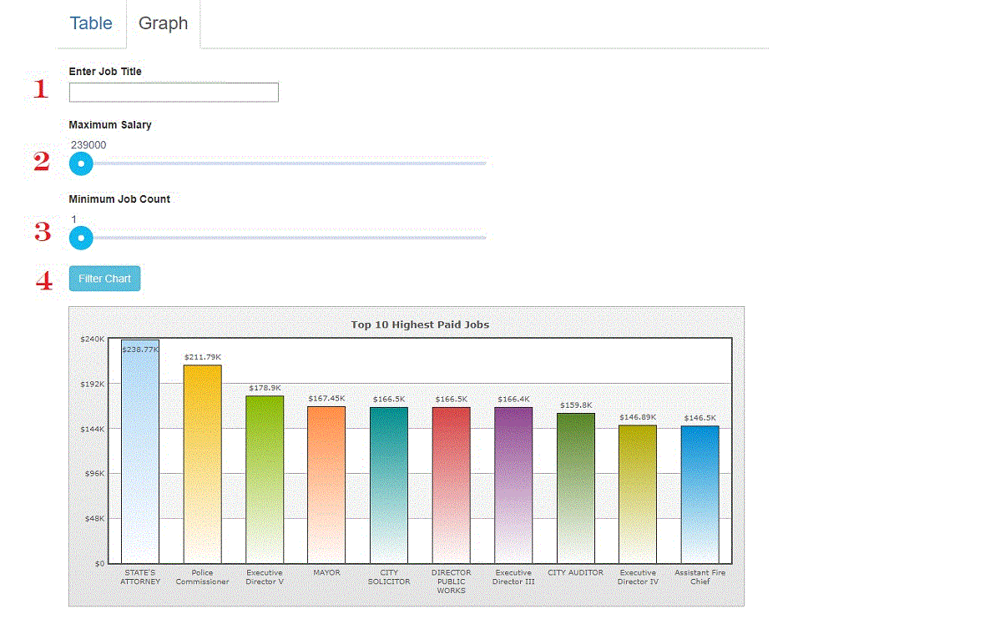

# Baltimore Employee Salaries 2015
Salary analysis of Baltimore public employees 2015 using OpenBaltimore dataset

# How to install
__Requirements:__

* Java JDK
* Maven

__Instructions:__

1. Clone the repository into a directory of your choice. This can be done by opening the command line interface and typing `git clone https://github.com/kchu1337/OpenBaltimore_Salary2015`

2. In the command line interface, run: `mvn clean`

3. Run: `mvn spring-boot:run`

4. Open the internet browser of your choice and type in localhost:8080

# How to use

### Table View

1. Switch between table and graph views.

2. Change how many items are shown per table page.

3. Add new salary data. A window will pop up to add new salary data. See [image 3](#help3).

4. Filter each category. Just type in the value and the chart will automatically filter.

5. Sort each category. Click on the button to sort ascending, descending, and back to default.

6. Filter by annual salary. Set the range of the annual salary and click the filter salary button. Click the reset salary filters button
to reset the salary filters. 

7. Edit existing salary data.  A window will pop up to edit existing salary data. See [image 3](#help3).

8. Delete the salary data. Deletes the row of data. 

9. Pagination. Change pages. 

### Graph View

1. Filter jobs based on job title.

2. Filter jobs to show only the jobs whose salary is less that this amount.

3. Filter jobs to show only those higher than this minimum job count.

4. Reloads the graph with the above filters.

### Edit/Add Salary View <a name = "help3"/>

This is the window for editing/adding salary data.
1. Enter in employee and salary information.

2. Save the changes.

3. Cancel the update/add and close window.

__Final design may differ slightly from above images__

# Tools used
* Spring Boot (JAVA)
* AngularJS
* Thymeleaf
* Bootstrap 3
* JQuery

### External modules:
* [Smart Table](https://github.com/lorenzofox3/Smart-Table)
* [AngularJS Fusion Charts](http://www.fusioncharts.com/angularjs-charts)
* [AngularJS-Slider](https://github.com/angular-slider/angularjs-slider)

__Data from [Open Baltimore](https://data.baltimorecity.gov/City-Government/Baltimore-City-Employee-Salaries-FY2015/nsfe-bg53)__
